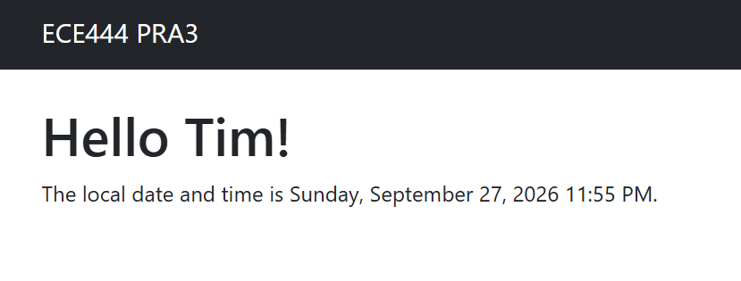
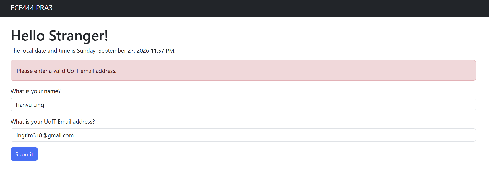

# ECE444 PRA3 - Flask and Docker

**Name:** Tianyu Ling

This repository is a clone of the Flasky textbook examples:
https://github.com/miguelgrinberg/flasky

This repository is created for ECE444 PRA3.

---

## Activity 1.3 - Flask Templates

Reproduced and modified the Flask Chapter 3 example.

The webpage includes:
- A navigation bar
- A personalized "Hello" message
- A timestamp displayed in `LLLL` format

---

## Activity 1.4 - Web Forms and UofT Email Validation

Added a Flask web form that accepts a user's name and email address.

The application validates whether the submitted email is a UofT email address by checking for `utoronto` in the email.

---

## Activity 2.3 - Prepare the Application for Docker

Updated the welcome message to:

> Hello [name]! Welcome to PRA3 Docker!

---

## Activity 2.4 - Docker

Dockerized the Flask application using a `Dockerfile` and `requirements.txt`.

The application can be built with:

    docker build -t ece444-pra3 .

and run with:

    docker run -d --name pra3-flask -p 5000:5000 ece444-pra3

The Flask application runs inside the Docker container on port 5000.

---

## Activity 2.5 - Chatbot with Memory

Implemented a simple chatbot using Flask sessions.

The chatbot can remember information across multiple requests in the same browser session.

Example:

> User: My name is Tim.  
> Bot: Nice to meet you, Tim!  
> User: What is my name?  
> Bot: Your name is Tim.

A Logout button clears the Flask session so that previously remembered information is removed.

### Memory Test

### Logout Test

